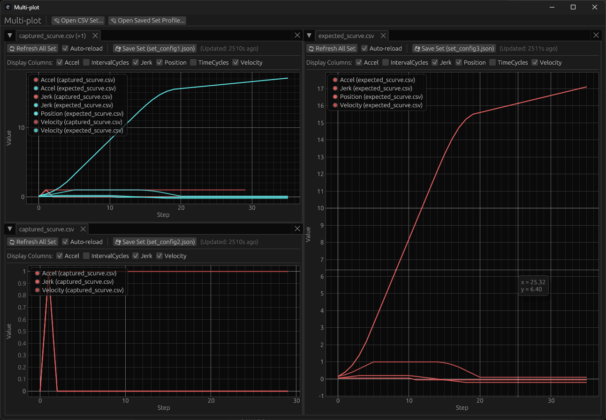

<div align="center">

[](https://discord.gg/ffwj5rKZuf)
[](https://www.youtube.com/channel/UClzmlBRrChCJCXkY2h9GhBQ?sub_confirmation=1)
[](https://github.com/MakerPnP)
[](https://ko-fi.com/dominicclifton)
[](https://www.patreon.com/MakerPnP)


</div>

# Multi-plot

Cross-platform multi-column CSV visualization and comparison utility.

Here's a recent screenshot:

[](assets/screenshots/plannergui/planner_gui_2025-04-22_132254.png)

The **Multi-plot** utility is a developer tool designed to visually inspect, overlap, and analyze time-series data from multiple CSV files.

## Modes

There are three main paradigms to how the Multi-plot tool manages, visualizes, and serializes dataset views:

* **Interactive GUI Mode:** Driven by `egui` and `egui_dock`, this provides an elegant tabbed layout to dock, split, and display multiple plots simultaneously.
* **Set Configurations:** A Set Configuration encapsulates a list of monitored CSV files along with custom column filter criteria (active/inactive columns). These profiles can be created inside the GUI, saved to `.json` files, and reloaded across launches.
* **Non-Interactive CLI Rendering:** The tool can operate entirely headless. By specifying output parameters via the command line, it generates publication-quality SVG files directly from CSV datasets and Set Configurations without starting the GUI.

### Other features

* Monitoring and automatic reloading of CSV files.

## Building

```
cargo build --release
```

This will produce a binary in the `target/release` directory called `multiplot` or `multiplot.exe` on Windows.

## Usage

### 1. Stateful GUI Re-launch (No Arguments)
When launched with no arguments, the tool acts as a stateful dashboard. It automatically remembers:
* All active tab sets, linked files, and custom toggled check-boxes (filters).
* Your exact window layout, panel splits, and focused tabs using native serialization.

Command:
```
multiplot
```

##### 2. Comparing CSVs Directly from Command Line
Launch the GUI with one or more raw CSV files automatically prepared into an active plotting tab:

Command:
```
multiplot path/to/motor_x.csv path/to/motor_y.csv
```

##### 3. Loading Set Configurations & Pre-filtering via CLI
Open specific saved `.json` configurations while stripping out noisy or unneeded columns on startup:

Command:
```
multiplot --set tuning_profile.json --filter "Jerk" --filter "Row Index"
```

##### 4. Headless SVG Asset Generation
Render a vector SVG graphic instantly from combined CSV files and saved Set Configurations:

Command:
```
multiplot --set calibration.json path/to/live_run.csv --output compare_render.svg
```

## Links

Please subscribe to be notified of live-stream events so you can follow the development process.

* Patreon: https://www.patreon.com/MakerPnP
* Source: https://github.com/MakerPnP/experimentations
* Discord: https://discord.gg/ffwj5rKZuf
* YouTube: https://www.youtube.com/@MakerPnP
* X/Twitter: https://x.com/MakerPicknPlace

## Authors

* Dominic Clifton - Product owner and AI prompter, README author.
* Google Gemini Flash - 99.99% of this tool's code is AI generated.

No humans have reviewed the code. YMMV.

## License

Apache or MIT at your option.

## Contributing

If you'd like to contribute, please raise an issue or a PR on the github issue tracker, work-in-progress PRs 
are fine to let us know you're working on something, and/or visit the discord server. See the [Links](#links) 
section above.
